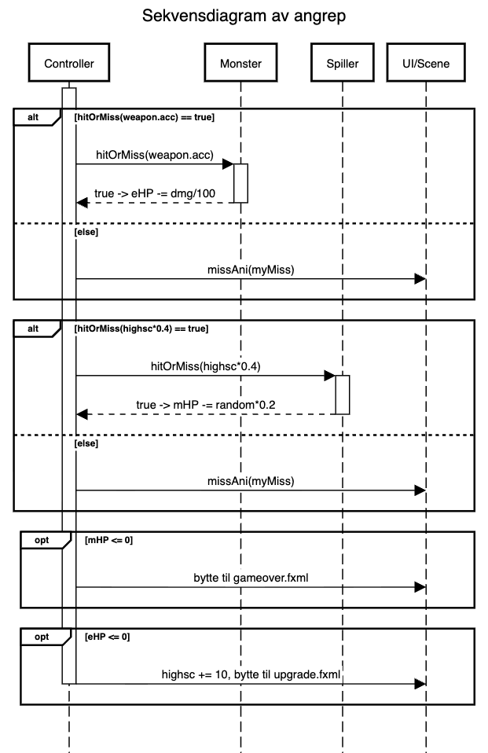

# Monster Mission

Prosjekt for TDT4100 Objektorientert programmering.

## Beskrivelse av spillet
Appen er et interaktivt spill utviklet i Java, hvor spilleren kjemper mot monstre ved hjelp av ulike våpen. Man kan velge mellom forskjellige våpen, noe som gir variasjon i spillestil og strategi. Underveis i spillet møter spilleren sterkere fiender som også må bekjempes gjennom angrep, hvor angrepet påvirkes av våpenets egenskaper som skade (damage) og treffsikkerhet (accuracy). Dette gjør at spilleren må ta aktive valg og tilpasse strategien sin for å lykkes i kampene.

En viktig del av spillet er progresjonssystemet, hvor spilleren kan oppgradere våpnene sine. Etter hvert som man spiller, får man mulighet til å forbedre både skade og treffsikkerhet, noe som gjør det lettere å håndtere sterkere monstre senere i spillet. Dette skaper en følelse av utvikling og mestring.

Applikasjonen er utviklet med JavaFX og SceneBuilder for å lage et grafisk brukergrensesnitt. I tillegg har spillet støtte for lagring og lasting av spilldata, slik at spilleren kan fortsette der de slapp.

## Diagram

## Spørsmål
- **Hvilke deler av pensum i emnet dekkes i prosjektet, og på hvilken måte? (For eksempel bruk av arv, interface, delegering osv.)**

Prosjektet dekker flere sentrale temaer fra TDT4100, spesielt innen objektorientert programmering og programstruktur. Først og fremst brukes klasser og objekter for å modellere spiller, monstre og våpen. Disse klassene inneholder både tilstand, som health, damage og accuracy, og oppførsel, som metoder for angrep og oppgraderinger.

Arv brukes til å strukturere ulike elementer i JavaFX. Interface-et Intializable benyttes og arver metoden initialize() som brukes for å definere blant annet fargen og mengde liv i healthbar-en.

Prosjektet benytter også innkapsling, ved at objektenes interne data beskyttes og kun manipuleres gjennom metoder. Videre brukes delegering, for eksempel ved at Controller klassen bruker Weapons klassen for å håndtere definering av våpen.

Gjennom bruk av JavaFX og SceneBuilder dekkes også pensum knyttet til grafiske brukergrensesnitt og hendelseshåndtering, der programmet responderer på brukerinput. Til slutt viser lagring og lasting av spilldata bruk av filhåndtering.

- **Dersom deler av pensum ikke er dekket i prosjektet deres, hvordan kunne dere brukt disse delene av pensum i appen?**

Selv om prosjektet dekker mye av pensum, finnes det flere konsepter fra TDT4100 som kunne vært brukt i større grad for å videreutvikle appen.

For eksempel kunne man tatt i bruk collections (som List, Map) for å håndtere flere fiender eller lagrede spilltilstander på en mer effektiv måte.

Man kunne også ha implementert observatør-observert tydeligere, for eksempel ved å la brukergrensesnittet automatisk oppdatere seg når spillerens helse eller våpenstatistikk endres.

Til slutt kunne man brukt mer avansert delegering og designmønstre for å skille tydeligere mellom spilllogikk og brukergrensesnitt, noe som ville gjort koden mer modulær og enklere å vedlikeholde.

- **Hvordan forholder koden deres seg til Model-View-Controller-prinsippet? (Merk: det er ikke nødvendig at koden er helt perfekt i forhold til Model-View-Controller standarder. Det er mulig (og bra) å reflektere rundt svakheter i egen kode)**

Koden følger i stor grad Model-View-Controller-prinsippet, men med noen forenklinger og overlapp mellom lagene.

Model-delen består av klassene som representerer spill-logikken som spiller, monstre og våpen. Disse håndterer tilstand, som health, damage og accuracy, og logikk knyttet til kamp og oppgraderinger.

View-delen er implementert ved hjelp av JavaFX og SceneBuilder, hvor FXML-filer definerer det grafiske brukergrensesnittet. Her vises informasjon som spillerens helse, potions og score.

Controller-delen knytter Model og View sammen, og håndterer brukerinput. Controller-klassen oppdaterer både spilltilstanden og brukergrensesnittet basert på handlingene til spilleren.

Samtidig er ikke separasjonen helt svart på hvitt. Controlleren har noe logikk som kunne vært flyttet til Model, for eksempel valg av våpen og lesing av filer. Dette gjør at ansvarsfordelingen ikke er helt ren. Likevel gir strukturen en god oversikt, og gjør det enklere å videreutvikle og forbedre koden mot en mer tydelig Model-View-Controller standard. 

- **Hvordan har dere gått frem når dere skulle teste appen deres, og hvorfor har dere valgt de testene dere har? Har dere testet alle deler av koden? Hvis ikke, hvordan har dere prioritert hvilke deler som testes og ikke? (Her er tanken at dere skal reflektere rundt egen bruk av tester)**

Testfilene for Monster Mission fokuserer på de mest kritiske delene av funksjonaliteten, spesielt der feil vil ha størst konsekvenser for brukeropplevelsen. Først har jeg laget tester for filhåndtering, der det verifiseres at spilldata både kan lagres og leses korrekt. Dette er viktig for å sikre at brukeren ikke mister fremgang. Videre tester testfilene kampmekanikken ved å sjekke ekstreme tilfeller av accuracy, nemlig når den er 0 og 20. Dette gir forutsigbare utfall som alltid bom eller alltid treff, og gjør det enklere å validere at logikken fungerer som forventet. I tillegg testes at highscore starter på 0 og øker med 10 for hvert monster som blir bekjempet, for å sikre korrekt progresjon.

Ikke alle deler av koden testes. Spesielt brukergrensesnittet JavaFX er vanskelig å få testet da det er i hovedsak knapper som brukes. I stedet har jeg prioritert å teste kjernelogikk og funksjonalitet i Model-delen. Denne prioriteringen er gjort fordi feil i den delen vil påvirke hele spillet, mens feil i GUI ofte er enklere å oppdage og rette manuelt.

## KI deklarasjon
- **Måtte du bruke KI for å få til prosjektet, eller var det bare tidsbesparende?**

Jeg måtte ikke bruke KI for å få til prosjektet. Det kan godt være at å søke på nettet eller spørre en studass ville ha hjulpet like godt, men det kunne ha tatt lang tid.

- **Dersom du brukte KI, prøvde du flere modeller? Lekte du deg litt med hva mulighetene er?**

Jeg brukte bare Claude, spesifikt Sonnet 4.6, fordi det var det første som kom opp og som var gratis fra Claude.

- **Dersom du brukte KI, i hvilken grad? Skrev den koden din? Spurte du om hjelp med debugging?**

Det jeg spurte Claude om var å sette opp et roadmap for meg slik at jeg kan lære meg å bruke JavaFX til å lage spill. Det jeg fikk tilbake var en anbefaling til å se på en youtube kanal ved navnet "Bro Code" og se på hans spilleliste om JavaFX og Scenebuilder.

Samt hadde jeg problemer ved å sette opp både JavaFX og JUnit i vscode og spurte om hjelp fra Claude. Siden dette var lite relevant for pensum, så fikk jeg den til å se over pom-filen og forklare, samt foreslå, endringer jeg måtte gjøre.
